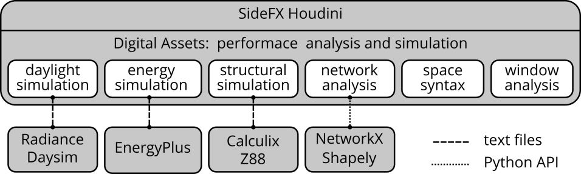

# Home

*Houdarcs, a library of plugins for Sidefx Houdini to support performance-based design.*

Houdarcs (Houdini Architecture Assets) is a library of nodes for SideFX Houdini for performing simulation and analysis of buildings and urban areas. In some cases, the nodes link to existing simulation engines or libraries. The figure above shows the relationship between the plugins and the simulation engines or libraries.

